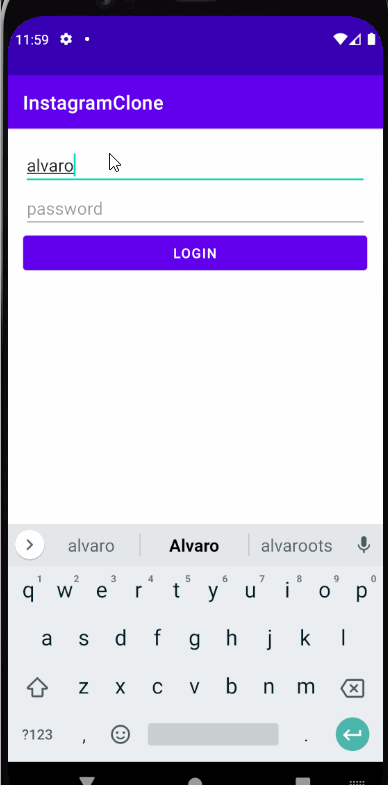

# Unit 4 Project: InstagramClone

## Overview
In this assignment, we'll be building Instagram from the ground up. Instead of using the Instagram API, we'll be building our own backend using Parse. By the end of the assignment, you'll have your own Instagram app that talks to your own Parse backend.
### Required Histories

User can sign up to create a new account using Parse authentication

User can log in and log out of his or her account

User can take a photo, add a caption, and post it to "Instagram" 

User can view the last 20 posts submitted to "Instagram"

The user should switch between different tabs - viewing all posts (feed view), compose (capture photos form camera) and profile tabs (posts made) using fragments and a Bottom Navigation View.

### Strech Histories

User sees app icon in home screen and styled bottom navigation view.

 

GIF created with [LiceCap](http://www.cockos.com/licecap/).

### Notes
I faced some challenges working in the permissions to post a new post to InstagramClone.

### Open-source libraries used

- [Android Async HTTP](https://github.com/codepath/CPAsyncHttpClient) - Simple asynchronous HTTP requests with JSON parsing
- [Glide](https://github.com/bumptech/glide) - Image loading and caching library for Androids

    Copyright 2021 Alvaroots97

    Licensed under the Apache License, Version 2.0 (the "License");
    you may not use this file except in compliance with the License.
    You may obtain a copy of the License at

        http://www.apache.org/licenses/LICENSE-2.0

    Unless required by applicable law or agreed to in writing, software
    distributed under the License is distributed on an "AS IS" BASIS,
    WITHOUT WARRANTIES OR CONDITIONS OF ANY KIND, either express or implied.
    See the License for the specific language governing permissions and
    limitations under the License.
